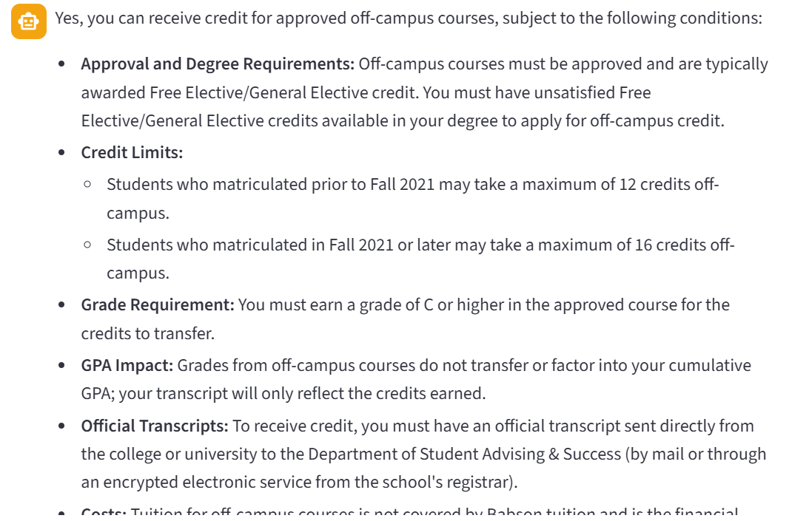
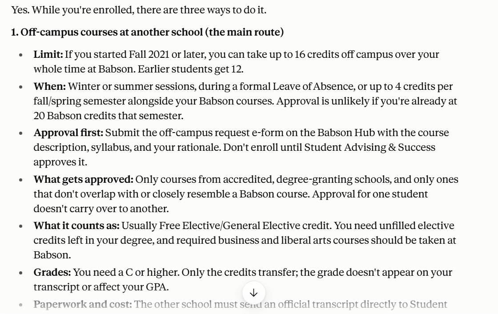
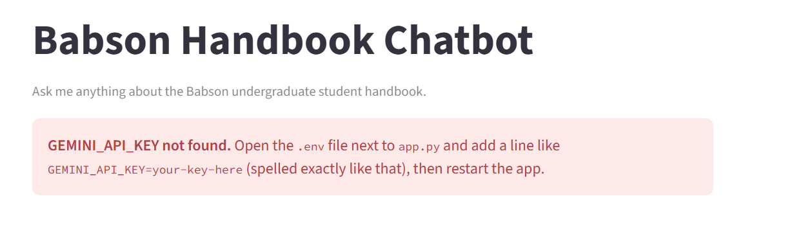
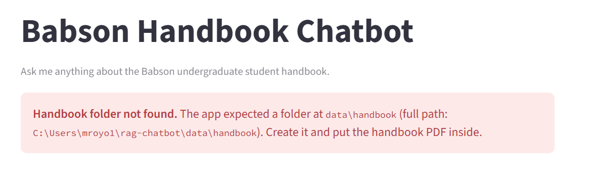
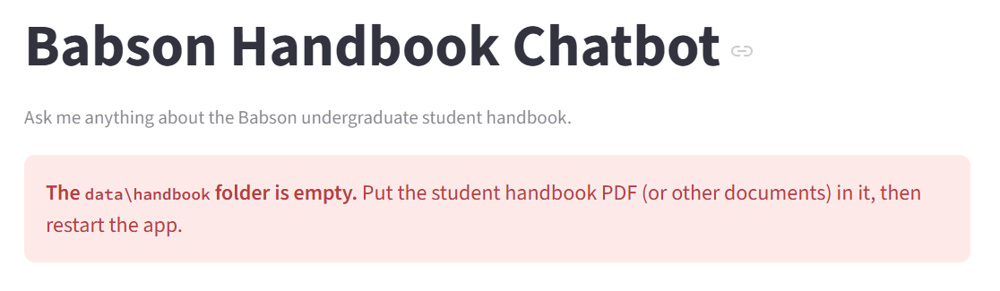
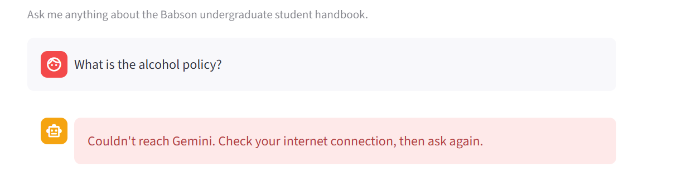
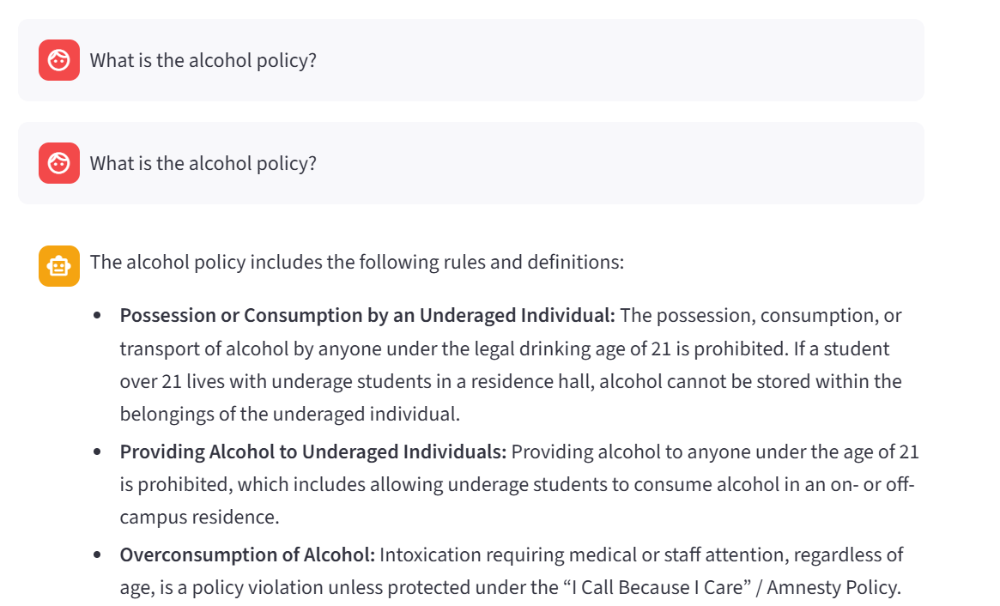

# Babson Handbook RAG Chatbot

OIM3641 – Activities 10 and 11. A Streamlit chatbot that answers questions about the Babson student handbook using RAG (LlamaIndex + Gemini).

**Run it:** `uv sync`, add `GEMINI_API_KEY=your-key` to a `.env` file, then `uv run streamlit run app.py`

## Results

| Question | My chatbot | Claude |
|---|---|---|
| Can I get credit for courses taken somewhere else? | Correct: 12/16 credit limit, C or better, transcript required | Correct and more detailed |
| Are any interest-free loans offered? | Correct: Mass No Interest Loan | Correct, plus federal subsidized loans |
| What if I'm a transfer student? (follow-up) | "No information": ignored the earlier questions | Understood the follow-up, explained transfer rules |

**My chatbot**

**Claude**

## Observations

- My chatbot gave accurate, Babson-specific answers because it reads the actual handbook. Claude gave even fuller answers because it had the handbook and read more of it. My bot only uses the 2 most relevant chunks.
- The follow-up question failed on my chatbot. It treated "What if I'm a transfer student?" as a brand-new question.
- Problems I had to fix: the PDF wasn't being read until I installed `llama-index-readers-file`, and `gemini-2.5-flash` was no longer available to new API keys, so I switched to `gemini-3.8-flash`.

## Memory

LLMs don't actually remember anything. Chat apps like Claude or ChatGPT re-send the whole conversation with every new message, so the model "sees" the history each time. When a chat gets too long, older parts get cut or summarized.

My chatbot has **no memory**. It saves the messages only to display them on screen. Each question goes to Gemini by itself, which is why the follow-up failed.

## Activity 11: Production-Ready Code

Same chatbot, but now it checks its setup before starting, stops with a helpful message when something is missing, and keeps running when a single question fails.

**What I changed**

- Refactor: grouped imports per PEP 8, used the `DATA_DIR` constant everywhere, added a docstring to every function
- Moved the API key check out of the cached function into `get_api_key()`, and passed the validated key into `get_query_engine(api_key)` and `GoogleGenAI(..., api_key=api_key)`
- Added checks for the data folder (missing, or empty)
- Wrapped building the engine and answering each question in `try … except`, with specific exceptions first and `except Exception` last
- Already done in Activity 10: `@st.cache_resource`, `VectorStoreIndex.from_documents()`, chat history with `st.session_state`, and a spinner while searching

| Check | What it protects against | Where in your code | Fail fast or fallback? |
|---|---|---|---|
| API key | Missing or misnamed `GEMINI_API_KEY` in `.env` | `get_api_key()`, lines 22–31 | Fail fast |
| Data folder exists | Renamed or deleted `data/handbook` folder | `check_data_dir()`, lines 36–41 | Fail fast |
| Data folder has files | Empty folder; hidden files like `.DS_Store` are ignored, since LlamaIndex skips them too | `check_data_dir()`, lines 43–50 | Fail fast |
| Building the engine | Corrupt or unreadable PDF, embedding model download failing | `try/except` around `get_query_engine()`, lines 95–108 | Fail fast |
| Answering a question | No internet, Gemini rate limit (429), invalid key, Gemini server errors | `answer_question()`, lines 68–85 | Fallback: shows an error, the app keeps running |
| Caching | Re-indexing the handbook on every question | `@st.cache_resource` on `get_query_engine()`, lines 56–65 | Not an error check (speed) |

**Testing it on purpose**

API key renamed in `.env`:

Data folder renamed:

Data folder empty (with a hidden `.DS_Store` file inside, which the check ignores):

Wi-Fi turned off, then a question asked:

Wi-Fi back on, same question asked again without restarting the app:

**Observations**

- The app has to be restarted after changing `.env` or the data folder, because a running app keeps the old key in memory and the old index in its cache.
- When a question fails, it stays in the chat history without an answer, so after the Wi-Fi test the question shows up twice.
